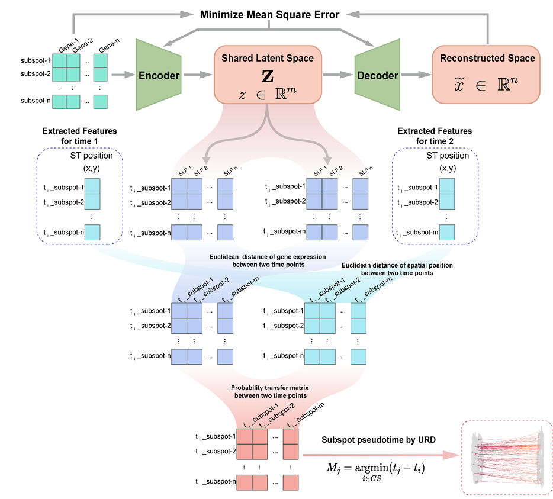
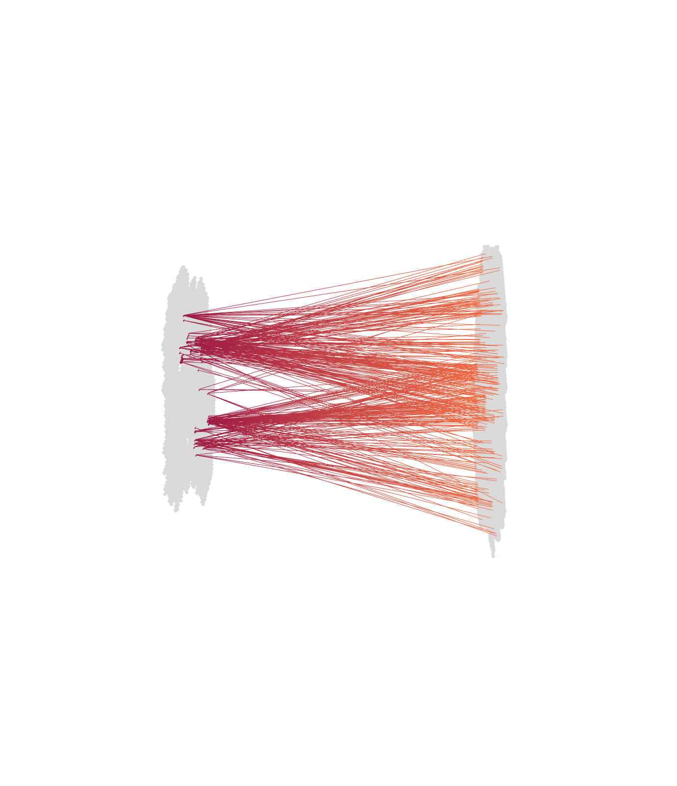

# STAE
STAE:Spatial Temporal Auto-Encoder  
This is an R package  
website url:http://db.regeomics.cn/

## Overview
&nbsp;  
With the spatial transcriptomics data of single-cell resolution, we can recognize the spatio-temporal patterns of planarian. As the single cell RNA-seq data are characterized by high signature dimensions and feature redundancy, the predictions made directly in the original space can lead to unsatisfactory pattern recognition for differentiation and migration. To discover the temporal and spatial pattern, we propose the Spatial Temporal Auto-Encoder (STAE) algorithm to extract recessive features from single cell data and fuse the cell’s temporal and spatial properties to infer differentiation and migration.  
&nbsp;  
&nbsp;  

&nbsp;  
&nbsp;  
## Installation
### Setup
STAE is available from GitHub with:

```
#If you don't have devtools installed, please install it first

install.packages("devtools")

devtools::install_github("zenglab-regeneration/STAE")

```

### Depend

Some programs of our project require a python environment, so if you don't have a python environment, please follow the steps below.  
* install [anaconda](https://www.anaconda.com/ "anaconda")
* Create a python3.9 environment  

When you have anaconda installed, you need to create a python conda.
```
conda create -n testconda python = 3.9
```

## Examples from paper
### Dataset 
- bimr before_iterative_mapping_result   -By matching single cells, the gene expression of the spatial data at the previous time point is obtained
- aimr after_iterative_mapping_result    -By matching single cells, the gene expression of the spatial data at the latter time point is obtained
- bsd before_sc_data                     -Gene expression in single cells at the previous time point
- asd after_sc_data                      -Gene expression in cells at the latter time point
- mg marker_gene                         -Cell's id number and type
- pse pseudotime                         -Pseudo-time information for each cell

### Environment settings


```
library('STAE')
help(package = 'STAE')

#set the py conda
env_python_set("D:/anaconda/envs/testconda")

#Check the dependent environment for the program to run, and automatically install the missing python package
env_test()
```
### Data_deal
```
data_deal(bimr,aimr,bsd,asd,mg,pse)  

#If you don't have a pse file please pass in an empty data frame
pse <- as.data.frame(matrix(nrow=0,ncol=3))
data_deal(bimr,aimr,bsd,asd,mg,pse) 
```
### Run
```
#position distance ratio
pdr = 0.1  
#pseflag ：Pseudo-time files are not used by default
pseflag <- FALSE
stae(pdr,pseflag)  
```
### Simple_draw
```
#Differentiation and migration of cell type
dam = c('Nb2') 
stae_draw(dam)
```

